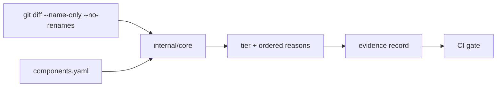

# git-native-sdlc-controls

[](https://github.com/codeaiforge/git-native-sdlc-controls/actions/workflows/controls.yml)
[](#tests)

A git-native, tooling-agnostic reference implementation of SDLC controls-as-code: it assigns a risk
tier to every change and enforces proportionate controls in CI, using only git primitives.

Reference implementation, not a product.

## What it does

Three controls, from a `git diff` and one declared component map:

| Control | What it does |
|---|---|
| **CAF-SDLC-002** | Assigns a risk tier (T0–T3) to a change from the declared blast radius of the paths it touches, and escalates the required review, approvers and checks to match. |
| **CAF-SDLC-010** | Records whether a change was AI-generated or AI-assisted, by which tool, under which session — as git trailers that travel with the commit. |
| **CAF-SDLC-011** | Requires that a change at a tier the policy marks `independent_approver_required` is approved by an account other than its author, and names that approver in the evidence. Segregation of duties between two forge accounts — not proof that the approver did not prompt the model. |

## Why git-native

Blast radius is usually computed from a dependency graph, which means a build-tool integration per
language — and no answer at all for the polyglot monorepo or the twelve-year-old service nobody wants
to touch. This computes it from two things every repository can produce: the paths a change touches,
and a declared component map committed alongside the code.

The result works on any repository: any language, any build system or none, monorepo or polyrepo. A
**single static binary** runs unchanged on GitHub Actions, GitLab CI, Jenkins or Azure DevOps — the
CLI is the product, and every CI adapter is a thin wrapper around the same invocation.

## How it works



The engine (`internal/core`) is pure: standard library only, no CI, forge or build-tool imports. It
takes changed paths and a component map, and returns a tier, the ordered list of reasons that produced
it, and a portable evidence record. See [docs/architecture.md](docs/architecture.md).

## Quickstart

Run the demo. Go and git are the only prerequisites, and it needs no network:

```console
$ make demo
```

It builds a throwaway repository shaped like [FINOS TraderX](https://github.com/finos/traderX),
commits four changes to it, and tiers each one against
[examples/traderx/components.yaml](examples/traderx/components.yaml). Two of the four are blocked —
this is the one-line change to a shared service:

```console
$ sdlc-controls tier --base main --head refdata-fix --config components.yaml --change-id DEMO-t3-reference-data --evidence-out evidence/t3-reference-data.json --author alice --approvers bob
change:  DEMO-t3-reference-data
tier:    T3
binding: git-native-baseline@1
affected: reference-data
unmatched: (none)
reasons:
  - reference-data criticality=high -> base T2
  - reference-data shared=true -> +1
required: min_approvers=2 checks=lint, sast, secrets, deps independent_approver=true
ai_assisted: false
warning: tier requires an owning-team reviewer (no owners declared in the component map): enforced by CODEOWNERS and branch protection, not verified by this run
FAIL: T3 requires 2 approver(s), found 1
exit: 1 — controls not met, the gate blocks the merge
```

Every run writes an evidence record. The demo's four are committed in
[examples/traderx/evidence/](examples/traderx/evidence/), so the output is readable before you run
anything; the full walkthrough — including an AI-assisted change its own author cannot approve — is in
[examples/traderx/](examples/traderx/).

## Use it on your own repository

Build the binary from a clone — one static binary, no runtime to install:

```console
$ make build
CGO_ENABLED=0 go build -o bin/sdlc-controls ./cmd/sdlc-controls
```

Once the module is published, `go install github.com/codeaiforge/git-native-sdlc-controls/cmd/sdlc-controls@latest`
fetches the same binary.

Copy [config/components.example.yaml](config/components.example.yaml) into your repository as
`config/components.yaml`, describe your components in it, and tier a change:

```console
$ sdlc-controls tier --base main --head HEAD --config config/components.yaml
change:  main..HEAD
tier:    T3
binding: git-native-baseline@1
affected: payment-authorization, shared-contracts
unmatched: (none)
reasons:
  - payment-authorization criticality=critical -> base T3
  - shared-contracts shared=true -> +1 (capped)
required: min_approvers=2 checks=lint, sast, secrets, deps independent_approver=true
ai_assisted: false
warning: approver set not supplied: approver controls recorded but not verified by this run
warning: tier requires an owning-team reviewer (@org/payments-core, @org/platform): enforced by CODEOWNERS and branch protection, not verified by this run
```

Exit code 0 when the change meets its tier's controls, 1 when it does not, 2 on error. That is the
whole CI integration.

The warnings are the point as much as the tier is. This tool decides the tier and checks what the
evidence can settle; approver rules and the named checks are enforced by branch protection and by the
CI jobs the policy names. Anything it did not verify itself says so, in the record, rather than
appearing to have passed. Pass `--approvers` and it verifies those too.

This repository runs the gate on itself, on two forges: in
[.gitea/workflows/controls.yml](.gitea/workflows/controls.yml) where its changes are actually
reviewed, and in [.github/workflows/controls.yml](.github/workflows/controls.yml) on the mirror. The
two differ in two places — reading the approver set out of the forge's API, and the version of the
artifact action each forge can serve — and call the same binary with the same flags.

Both run on pushes to `main` as well as on pull requests, because most changes here land as a direct
push and a gate that only fires on pull requests would tier none of them. A push run tiers the pushed
range and writes the evidence record, but it cannot verify approvals — there is no approver set to
read — so it records those controls as required and unverified. Only a pull request can settle them.
The badge above is the mirror's history of those runs.

## The honest ceiling

Blast radius here is a **declared-topology approximation**, not a computed dependency graph. A
component's criticality and its `shared` flag are maintained by humans, so a high fan-in component
that nobody declared shared will be under-tiered, and the map drifts unless it is looked after.

That is a deliberate trade: accuracy given up for universality. A computed graph needs a build-tool
integration per language, which is precisely what stops that approach reaching the repositories that
most need controls. Two things keep the approximation honest — an undeclared path fails safe to a
higher tier rather than passing quietly, and changes to the map itself self-escalate to the top tier.
Neither turns it into a graph. See
[CAF-SDLC-002](docs/controls/CAF-SDLC-002-change-risk-tiering.md).

## Scope: what is here, and what deliberately is not

Here: the tiering engine, the evidence schema, the tooling-agnostic control definitions, the CLI and
the demo. Everything needed to put proportionate change control on a repository, Apache-2.0, no
strings, no account, no hosted service in the path.

Not here: the mapping from these controls to the clauses of any particular regulation. Which article
a tier satisfies, what an assessor accepts as evidence for it, and how mature a practice has to be to
survive review are all specific to an entity — its critical functions, its risk appetite, its
supervisor. Published as if universal, such a mapping is exactly the artefact people cite and then
find does not hold for them, and the harm lands on the reader rather than the author. The engine is
general; the interpretation is not, so the interpretation is not in the box.

That boundary is deliberate: the controls are open source because controls nobody can inspect are not
controls. Making them stand up in front of your own regulator is a different piece of work, one that
has to know your organisation — a conversation rather than a file. See [Maintainer](#maintainer).

## Tests

```bash
go test ./...           # everything
go test ./... -cover    # with coverage
```

`internal/core` is table-driven throughout: the tier algorithm, the T3 cap, the unmatched-path
fail-safe, trailer parsing and the independent-approver control each have their own cases.
`cmd/sdlc-controls` covers flag parsing, git invocation, the exit-code contract and
`--evidence-out` against throwaway repositories built in the test itself.

The badge states a floor, not a snapshot, and CI fails the build if coverage falls below it — a
number nothing checks is a claim rather than evidence, which is the same standard this tool holds
its own evidence records to.

## Alignment

Aligned to the emerging FINOS SDLC controls framework. Not endorsed by, or part of, FINOS.

The approach supports DORA change-management outcomes — proportionate control over changes to critical
systems, with evidence — as *a* compliant means, not the only one.

## Maintainer

Built and maintained by [CodeAIForge](https://codeaiforge.com) — open an issue, or get in touch if
you want help running this on real repositories.

## License

Apache-2.0.
