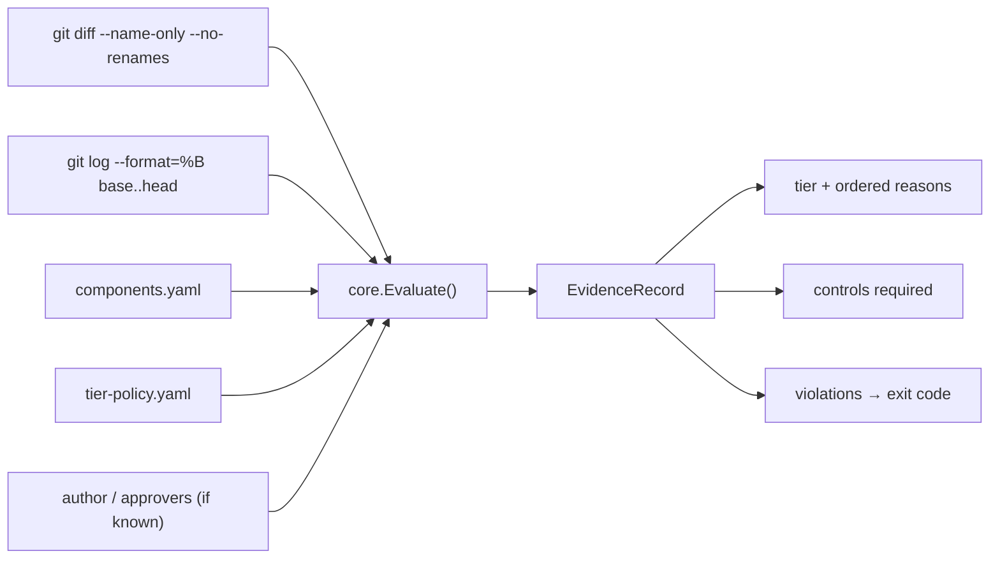

# Architecture

## The split

```text
cmd/sdlc-controls        CLI — gathers inputs, does all I/O, formats output
  ├── internal/contract  the serialization boundary — versioned wire DTOs
  └── internal/core      the engine — pure functions, no I/O, no CI knowledge
schemas/                 the published JSON Schemas those DTOs satisfy
action.yml               GitHub Action metadata (at the root; see below)
action/Dockerfile        the image it runs: builds the same binary, no logic
```

`internal/core` imports the standard library only. It does not know what a pull request is, what
GitHub is, or what language the repository under test is written in. It takes changed paths, commit
messages and a declared component map, and returns a tier, a reason list and an evidence record.

Everything platform-specific lives above it: shelling out to `git`, reading YAML, deciding an exit
code, printing for a CI log. That boundary is what the "tooling-agnostic" claim actually means here —
it is a compile-time property, not an aspiration, and `go list -deps ./internal/core` is the check.

## Data flow



1. `ResolveComponents` matches changed paths to declared components → affected / unmatched.
2. `ComputeTier` applies the CAF-SDLC-002 algorithm → tier + ordered reasons.
3. `ParseProvenance` reads the CAF-SDLC-010 trailers off the commit messages.
4. `BuildEvidence` assembles the record; `Violations()` reports what the evidence itself settles.
5. `contract.EvidenceFromCore` maps that record onto the versioned wire DTO; the CLI renders it as
   text or JSON and picks an exit code.

## The serialization boundary

```text
internal/core       domain types (EvidenceRecord, Tier, TierControls) — standard library only
   ↓  one way
internal/contract   explicit wire DTOs + mapping; asserts schema_version
   ↓
cmd/sdlc-controls   renders text or JSON, chooses an exit code
```

`internal/core` does not import `internal/contract`. The dependency points one way, so the engine
stays free of wire concerns and the published shape stays free to version on its own schedule.

The DTOs are written out by hand and mapped field by field rather than derived by tagging the core
structs. That is the point rather than an oversight: the JSON is an interface other people depend on,
and a rename inside the engine has to break the mapping — and show up in review — instead of silently
changing what a consumer receives. The mapping is also where `schema_version` is asserted, and where
the honesty invariant is projected into `verification.verified` / `verification.recorded_not_verified`.

The binary carries three independent version axes — binary, schema, policy binding. See
[contract.md](contract.md) for what each one means and when it moves. The JSON Schema validator used
to check the emitted documents is a **test-only** dependency:
`go list -deps ./cmd/sdlc-controls` never names it.

## Why the CLI is the product

A single static binary (`CGO_ENABLED=0`) runs unchanged on GitHub Actions, GitLab CI, Jenkins and
Azure DevOps. Each adapter is a wrapper that supplies `--base`, `--head` and `--config` from whatever
that platform calls them, and interprets the exit code. Adding a platform means writing a job
definition — no change to `internal/core`, and no second implementation of the algorithm to keep in
step with the first.

That is demonstrated rather than asserted: the gate runs on two forges, in
[.gitea/workflows/controls.yml](../.gitea/workflows/controls.yml) and
[.github/workflows/controls.yml](../.github/workflows/controls.yml). They differ in two places, both
forced by the forge rather than by the controls: reading the approver set out of its API (`gh api` on
one, `curl` on the other), and the version of `upload-artifact` it can serve. The rest is the same
binary with the same flags.

The GitHub Action is exactly this: a multi-stage Dockerfile that builds the binary and sets it as the
entrypoint. It has no logic of its own.

Its metadata lives at the repository root rather than in `action/` because a local Docker action is
built with the action metadata's own directory as the build context. Kept in `action/`, the image
could see only `action/` and would have to fetch the CLI from a published module — a wrapper that
cannot be built from the source sitting beside it. At the root, `docker build -f action/Dockerfile .`
is exactly what the runner does, which is why CI builds it on every pull request.

## What enforces what

| Concern | Enforced by |
|---|---|
| tier decision, reasons, evidence | this tool |
| AI provenance present and complete | this tool (fails the gate) |
| approver count, independent approver | the forge's branch protection; verified here when an approver set is available |
| owning-team reviewer | CODEOWNERS and branch protection; recorded here as required-but-unverified, naming the owners |
| lint / sast / secrets / deps | the CI jobs the policy names |

Every row of that table appears in the evidence record's `verification` block, on one side or the
other: `verified` for what this run settled, `recorded_not_verified` for the rest. The prose
`warnings` say the same thing for a human reader.

The tool computes and records the requirement. It does not pretend to be the merge button. What it will not do is record a control it did not check as one that passed: everything in the right-hand column that this tool does not enforce leaves a warning in the evidence saying who does.

## Deliberate non-goals

- **No dependency graph.** Blast radius comes from the declared map. See the honest ceiling in
  `docs/controls/CAF-SDLC-002-change-risk-tiering.md`.
- **No build-tool integration.** The moment tiering needs `mvn`, `npm` or `bazel` to resolve, it stops
  working on the repositories that most need it.
- **No server, no database.** The evidence record is a file; the forge and CI already have storage,
  retention and access control.
